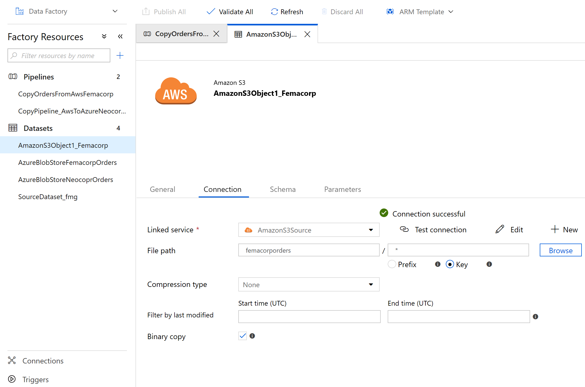
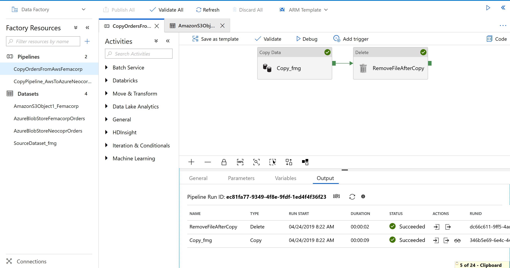
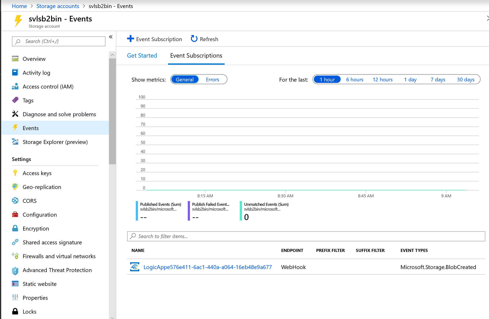

# serverless
Solution accompanying the blog article on Serverless architectures - covers a scenario where an Organization (Contoso) implements a Business to Business Integration scenario with 2 fictitious Trading Partner Organizations(Neocorp and Femacorp). These organizations have their Line of Business Systems deployed in AWS from where orders to be sent to Contoso are deposited in an S3 Bucket. For simplicity here, a single AWS Account is used with 2 S3 Buckets created in them, one per Trading Partner.
 

## Order Pickup Pipeline
DataSource Connection Source - Two pipelines one per Trading Partner is created in AWS S3. 

DataSource Connection Target - An Azure Storage Account **svlsb2bin** with 2 Containers, one per Partner, is created

The ADF Pipelines created for this scenario are available in the ARM Template *./arm template/datafactory/arm_template.json*
Run this template to deploy the ADF Pipelines in your subscription. Edit the *arm_template_parameters.json* file to add the AWS S3, Azure Storage accounts and Access keys in your Subscription.

Upload the sample files to S3 Buckets, trigger the ADF Pipeline in Azure to move the files to Azure Storage Account. Screenshot below shows the outcome of the Pipeline run.

## Order process Flow - Event Trigger

### Event Grid Topic Subscription
An Event Grid Topic Event is configured on the Storage Account **svlsb2bin**. A Subscription is created on a 'Blob created' Event for the Logic App Process Flow **ordergenflow**. This triggers the Logic App process. Screenshot below shows the trigger from Event Grid that triggers the Logic App.

### Business Process Flow - Logic App

### Order data Store

## Order Approval

### Azure Functions (FaaS)

### API Gateway

### App for order data approval

## Order Business Monitoring

### Web Application - Service Fabric Mesh

### Multi-tenancy

##

