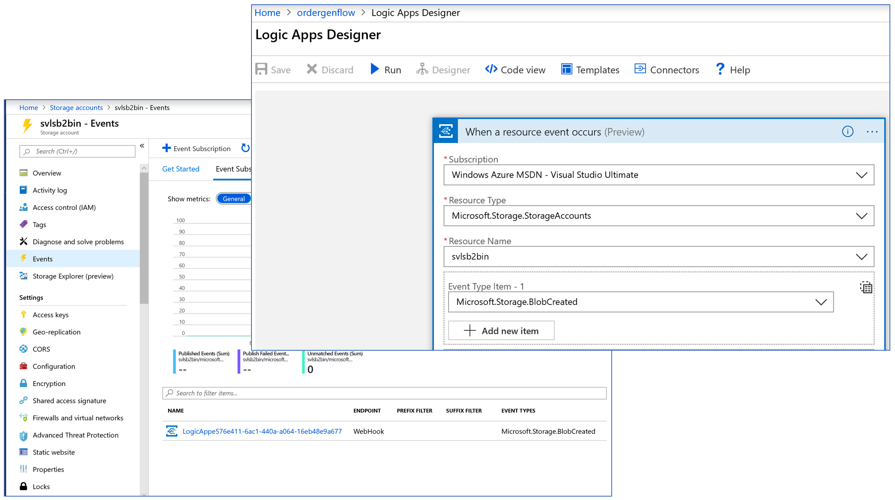

# serverless
Solution accompanying the blog article on Serverless architectures - covers a scenario where an Organization implements a Business to Business Integration with 2 Trading Partner Organizations. 
 
## Order Pickup Pipeline
The Trading Partners upload the orders to an AWS S3 Bucket. For simplicity here, a single AWS Account is used with 2 S3 Buckets created in them, one per Trading Partner.

ADF Pipelines are used to move the order data from AWS S3 Bucket to Azure Blob Store. In the sample accompanying this article, there is one ADF Pipeline created per Trading Partner. Screenshot below shows the ADF Connection to AWS S3 Bucket.

The ADF Pipeline moves the orders to an Azure Storage Account **svlsb2bin** with 2 Containers, one per Trading Partner.

The ADF Pipelines created for this scenario are available in the ARM Template *./arm template/datafactory/arm_template.json*

Run this template to deploy the ADF Pipelines to your subscription. Edit the *arm_template_parameters.json* file to add information like the AWS S3, Azure Storage accounts and Access keys applicable to your Subscription.

Upload the sample files to S3 Buckets, trigger the ADF Pipeline in Azure to move the files to Azure Storage Account. Screenshot below shows the outcome of the Pipeline run.

## Order process Flow - Event Trigger

### Event Grid Topic Subscription
An Event Grid Topic Event is configured on the Storage Account **svlsb2bin**. A Subscription is created on a 'Blob created' Event for the Logic App Process Flow **ordergenflow**. This triggers the Logic App process, when a file is inserted to the Storage Account. Screenshot below shows the Logic App trigger configuration from Event Grid.

### Business Process Flow - Logic App

The Azure Logic App accompanying this article is available in the Repo. Look for the Visual Studio Solution Project *./b2blogicapp/b2blogicapp.sln*. Compile the Solution, right click the **Logicapp.json** file to view it in the Designer.

To deploy this Logic App to your Subscription, select 'publish' on the **Logicapp.json**. Edit the configuration parameters in it to suit your Azure Subscription, before publishing.

For simplicity here, a single Logic App is used to handle the process flow pertaining to both the Trading Partners. Based on the folder where the order document was inserted, the Logic App instance determines which Partner this order document pertains to. The Logic App flow now branches into a Partner specific flow. The incoming data is parsed using a JSON Schema, and Business rules are applied to determine whether the order can be approved, or whether it should be flagged for user intervention. 
The Business rules in the flow are, for simplicity, embedded in the Logic App itself, rather than looking up an external database. After the Business rules are applied, the order status is updated. See screenshot below which shows how the Order status is updated based on the outcome of a Business rule evaluation.

Since the order data schema is different across Partners, before the data can be saved in the Azure Storage Table **ordersdata**, it has to be mapped to the target schema. For simplicity here, the source document itself is modified by the Logic App using 'addProperties' and 'removeProperties' inline functions.

### Order data Store
The Partnername in the order is used as the Partition Key in the Storage Table, and the Order number is used as the Rowkey
At the end of the Logic App flow, the order data gets stored in Azure Storage Table.

## Order Approval

### Azure Functions (FaaS)

The source code of the Azure Function App **ordersflow** used in this sample is available in the Visual Studio 2017 Solution located at ./ordersflow/ordersflow.sln in the Repository. There are 2 Functions created that are exposed as HTTP callable APIs
- Get orders pending approval
- approve an order in the Storage Table

To deploy this Function App to your Subscription, edit the localsettings.json file to update the Connection string to the Storage Table. Publish the Project to your Azure Subscription.

### API Gateway
Acts as the facade to the APIs exposed by the Function App. A Consumption tier is chosen for the API Management Gateway instance to use the Serverless characteristics. From the API Management Console, use the built in ability to import an existing Function App. From the testing console on the API Management Console, ensure you are able to execute the APIs exposed by the Function App successfully.

### App for order data approval

#### Create custom connector for the Function App APIs in PowerApps 
From the API Management Gateway instance **orderfacade**, use the built in feature to export the Open API specification for an API. Import this file into PowerApps custom connector. See the screenshot below. Test each of these definitions and ensure that you are able to invoke the Function App APIs. At the end of this step, a custom connection instance is created from this custom connector in PowerApps.

#### Create the PowerApps App

The PowerApps App **OrderApproval** file acompaying this article can be accessed from ./powerapp/OrderApproval.mapp in the Respository.
Load all the orders pending approval, and ensure that you are able to update the status to 'approved' or 'rejected' as the case may be.  

## Order Business Monitoring

### Web Application - Service Fabric Mesh

The ASP.NET Core 2.0 Mvc Project for this Web Application is available in this Visual Studio Solution file ./Portal/OrderFlowBusinessMonitor/OrderFlowBusinessMonitor.sln in the repository.

For this project, Docker Containers is enabled, and Docker Swarm as the orchestrator. This creates the necessary Dockerfile & Docker Compose files for the Solution. Use Docker commands to tag and push the container image to Azure Container Registry, after compiling the Solution.

This Web Application is integrated with Azure Active Directory for user authentication, using the turnkey capabilities in the Visual Studio 2017 Project Template. The option to support Multi-organization Azure AD Tenant was selected when creating the Project to support Multi-tenancy.

To test the scenario, 2 Azure AD Tenants were created in the Azure Subscription, one per Trading Partner. A user in the Role 'Global Administrator' was created who would approve the use of the Web Application by all Organiational users in that Azure AD Tenant.

An ARM Template is used to provision the Azure Service Mesh Application. The ARM Template is available in the Reposiory at the location ./arm templates/sfmesh/deploysfmeshapp.json. Run this template to deploy the Service Fabric Mesh Application. Retrieve the Public IP Address created for it during the deployment operation and launch the Application. On user sign in, the order data should be visible.

Screenshot below shows the list of Azure Services deployed to implement this scenario.

